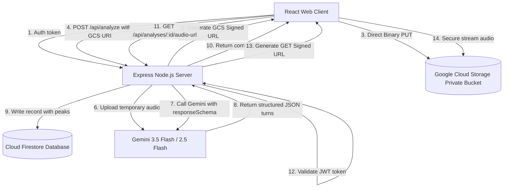

# Audiolab v3.0 - Gemini Audio Multimodality & Call Analyzer

Audiolab is a production-grade, serverless web application designed to analyze audio conversations using Gemini's native audio multimodality. It performs acoustic tone classification, speaker diarization, client emotion tracking, and technical audio quality scoring, combined with secure, isolated Google Cloud Storage call archives and a Firestore database history.

---

## ✨ Features

### 🎙️ Acoustic Tone & Emotion Diarization
- **Multimodal Diarization**: Goes beyond simple text-only transcription by leveraging Gemini's ability to ingest direct audio signals. It analyzes pitch, intonation, volume, and speech speed.
- **Emotion Tokens**: Mapped to each speaker dialogue turn (`neutral`, `satisfaction`, `frustration`, `hesitation`, `surprise`).
- **Interruption Overlap Detector**: Detects when speakers talk simultaneously or when the agent cuts off the client.

### 📊 Interactive Sentiment Heatmap Player
- **Pre-computed Waveforms**: Decodes binary WAV files on the backend to generate downsampled amplitude peak arrays in microseconds, keeping browser rendering lightning-fast.
- **Visual Heatmap Timeline**: High-fidelity canvas player color-coded by the speaker's emotional state (Red for frustration, Green for satisfaction, Yellow for hesitation).
- **Skip to Friction**: A quick shortcut button allowing call supervisors to jump straight to critical friction or client frustration zones.
- **Web Audio Equalizer (Voice Clarifier)**: Integrated DSP filter (Highpass at 250Hz and Lowpass at 3200Hz) that attenuates background rumble and hiss, leaving human voices crystal clear.
- **Speed Adjustment**: Native rate adjustments from `0.75x` (to review details) up to `2.0x` (to fly through long calls).

### 🔒 Secure User-Isolated Audio Archiving
- **0MB Server RAM uploads**: Authenticated users obtain an ephemeral `PUT` Signed URL and upload calls directly from the browser to an encrypted private GCS bucket, avoiding server RAM OOM issues.
- **Secure Playback**: Playback requests trigger a verification endpoint checking Firebase JWT tokens and issuing 15-minute temporary `GET` Signed URLs.
- **Ownership Isolation**: Storage paths are structured as `gs://audiolab-archives-{projectId}/{userId}/{analysisId}.wav` matching Firestore security rule constraints.

---

## 🏗️ Architecture

The application is built on top of a serverless, highly scalable Google Cloud Platform (GCP) and Firebase infrastructure:



---

## ⚙️ Local Development

### Prerequisites
- Node.js (v18+ recommended)
- A Google AI Studio API key

### 1. Configure Secrets
Create a `.env.local` file in the root directory:
```bash
GEMINI_API_KEY=your_gemini_api_key_here
```

### 2. Install and Start
```bash
# Install dependencies
npm install

# Start local server (Vite + Express backend)
npm run dev
```
Open **[http://localhost:3000](http://localhost:3000)** in your browser.

---

## 🚀 Cloud Deployment (Production)

Audiolab is prepared for production-grade serverless deployment on Google Cloud Platform.

### 1. Infrastructure Provisioning (Terraform)
1. Navigate to the `terraform/` directory:
   ```bash
   cd terraform
   ```
2. Copy the variable definitions file and fill in your GCP project credentials:
   ```bash
   cp terraform.tfvars.example terraform.tfvars
   # Edit terraform.tfvars with your GCP project_id and preferred region
   ```
3. Initialize and apply:
   ```bash
   terraform init
   terraform apply -auto-approve
   ```
   This provisions Artifact Registry, Firestore databases, Google Secret Manager, the GCS private archives bucket, and the Cloud Run service.

### 2. Build & Deploy (Finalization)
Return to the root directory and run the automated serverless deployment script:
```bash
cd ..
echo "1" | ./scripts/finalize-deploy.sh
```
This script:
- Generates `firebase-applet-config.json` containing the new Firebase keys.
- Deploys rules defined in `firestore.rules` directly onto Firebase.
- Triggers **Google Cloud Build** to compile, package, and push your docker container, rolling out the revision live on **Cloud Run**.

### 3. Post-Deployment Configuration
To enable Google Sign-In on your live Cloud Run site:
1. Copy your Cloud Run domain (e.g. `audiolab-service-XXXX.run.app`) printed by the deploy script.
2. Go to **[Firebase Authentication Settings](https://console.firebase.google.com/u/0/project/YOUR_PROJECT_ID/authentication/settings)**.
3. Click **Authorized Domains** > **Add Domain**.
4. Paste your domain and click **Add**.
